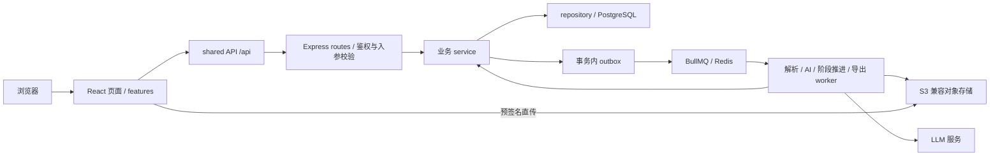

# 项目审阅：质量、架构与功能进度

> 修复更新：本报告保留初次审查结论。B1–B8 的修复方案、回归和浏览器验收结果见 [同日修复验收记录](2026-09-24-project-review-fixes.md)。下文“待修”等表述为修复前状态。

审阅日期：2026-09-24。基线提交：`4cb8019`。范围：当前 monorepo 源码、规划、测试、构建、CI 配置，以及针对性 API / 浏览器复现。本次没有修改业务代码、提交 Git、部署或切换业务。

## 1. 结论

**项目已经具备完整的核心业务骨架，目录和架构适合继续维护；但还不能按“功能全部完成、可直接上线”验收。**

- 工程基础较好：前后端静态检查、构建和现有 251 个测试全部通过；有权限层、数据库迁移、事务性 outbox、异步任务、运维脚本和文档。
- 确认 8 项缺陷：6 项 P1（数据权限、数据正确性或流程阻断），2 项 P2（常用入口和连续作业异常）。均有针对性复现，详见下文。
- 主要短板是业务边界和测试场景覆盖，尤其是跨空间资源引用、任务完成后的写入、整数分配余数、较大数据量和消息重复消费。
- M0–M5 的核心流程已实现，但存在原规划缺项；M6 只是部署准备，实机部署、历史数据处理和业务切换未完成。

建议保留现有架构，先修复下列具体问题。没有证据表明当前需要微服务化、重组整个目录或再做一次重写。

## 2. 本轮实际验证

| 检查 | 本轮结果 | 本地日志 |
|---|---|---|
| 两端 ESLint | 通过，0 error；前端 75 warning | `artifacts/review-lint.log` |
| 两端 TypeScript | 通过 | `artifacts/review-typecheck.log` |
| 后端 Prettier | 通过 | `artifacts/review-format.log` |
| 仓库发布打包测试 | 3 / 3 通过 | `artifacts/review-tests.log` |
| 后端测试 | 19 文件、191 / 191 通过 | `artifacts/review-server-tests.log` |
| 前端测试 | 8 文件、57 / 57 通过 | `artifacts/review-web-tests.log` |
| 两端生产构建 | 通过 | `artifacts/review-build.log` |
| 前端入口体积预算 | gzip 271.2 kB / 300 kB；最大 chunk gzip 176.5 kB / 200 kB | 同上 |
| 后端专项复现 | 跨空间引用、提交后覆盖、比例余数、5000 条样本建任务，均复现 | `artifacts/review-reproduce-results.json` |
| 重复消费专项复现 | 已完成审核重开、重解析导致原任务样本丢失，均复现 | `artifacts/review-replay-results.json` |
| 浏览器专项复现 | 通知进入质检走错页面；连续提交后错误显示全部处理完成 | 本报告 B7 / B8 |

环境：Windows、Node 24.14.0、npm 11.9.0、本地 PostgreSQL / Redis / MinIO。第一次根 `npm test` 因 Docker 未启动、Redis 不可连接而中断；启动项目基础设施后，分别重跑后端与前端测试通过。这次没有再次声称根命令一遍通过。

后端测试使用专用 `markflow_test` 数据库；现有测试全局前置会重建该测试库。专项复现也只使用测试库与测试队列，未对开发业务库造数。`artifacts/` 下日志与复现脚本为本机产物，不随 Git 提交；本报告保留了关键结果和操作步骤。

本轮没有重复跑完整 M0–M5 浏览器脚本、Linux 发布回滚演练、生产模型效果测试、生产容量压测、依赖漏洞审计或云端 Actions 验收。历史验收证据仍见 [verification.md](../verification.md)，与本轮结果分开看。

## 3. 已确认缺陷

优先级：P1 为上线前应处理的数据权限、正确性或核心流程问题；P2 为影响正常操作但存在绕行路径的问题。顺序综合影响和触发频率，不代表修复工作量。

### B1 · P1：创建任务可跨空间引用不属于自己的数据集

位置：[case.service.ts](../../apps/server/src/modules/task/case.service.ts)，205、588–598 行；后续读取见 [task.service.ts](../../apps/server/src/modules/task/task.service.ts) 的 `getSampleData`。

创建 Case 只校验调用者对目标空间的管理权限；`validateDatasetVersion` 只检查版本存在、未删除、READY，没有沿 `version.datasetId` 校验数据集所属空间。随后将该版本的全部样本派给目标空间的成员，读取样本时又只校验当前任务权限。

复现：创建互不授权的空间 A、B；用 A 的标注管理员身份创建 Case，传入 B 的 READY `datasetVersionId`；A 的标注员再读已派发任务的样本。

实际结果：`createCase.success=true`、`getSampleData.success=true`，且任务的源样本 ID 确认属于 B。不是仅能看到一个版本编号，而是可以读到样本内容。

建议：创建任务时关联校验数据集归属及访问权限。当前产品没有显式跨空间共享能力，应要求数据集与 Case 同空间；同时核验数据集类型和所选标注工具匹配。补一条跨空间拒绝测试。

### B2 · P1：5000 条样本的数据集无法创建标注任务

位置：[case.service.ts](../../apps/server/src/modules/task/case.service.ts)，263 行；[dispatch-engine.ts](../../apps/server/src/modules/task/dispatch-engine.ts)，154–175 行；[task.repo.ts](../../apps/server/src/modules/task/task.repo.ts)，`batchInsert`。

创建 Case 一次读取全部样本 ID，并将所有任务拼成一条多值 INSERT。每条任务绑定 15 个参数，5000 条产生 75000 个参数，超过 PostgreSQL 协议参数数量限制。

复现：准备含 5000 条有效样本的 READY 版本，创建仅人工标注阶段的 Case。

实际结果：接口返回 `success=false, code=SYSTEM_ERROR`；底层错误为 `bind message has 9464 parameter formats but 0 parameters`。创建事务回滚，不是仅派发速度慢。

建议：任务入池按适当批次插入，例如 500 条一批，并保留事务边界；批量查询也避免无限增长的 IN 参数。补“5000 条样本可建任务且总数正确”的测试。数据集解析本身已有分批，但任务创建没有，因此现有 2500 行解析测试无法发现此问题。

### B3 · P1：任务提交后，原标注员仍能覆盖已交给审核的结果

位置：[task.service.ts](../../apps/server/src/modules/task/task.service.ts)，229–248 行、`writeResultSample`。

`saveTaskResult` 检查任务归属和 Case 未结束，却不检查任务是否已 DONE。任务提交后仍保留原标注员，覆盖写会修改审核正在读取的同一条结果。

复现：在有多条样本的 Case 中，完成一条标注并等待其进入审核；原标注员再次调用该标注任务的 `saveTaskResult`。

实际结果：原标注任务仍为 `status=4`，保存却返回成功；审核员读到的结果从 `before-review` 变成 `changed-after-submit`。

建议：只允许当前轮次、当前持有人且在手状态的任务保存，并与提交 / 回收做原子状态校验。审核后的修改应走明确的重标流程。仅在前端禁用输入不足以保证数据一致性。

此行为在旧规则表 §4.1 中写明“沿用 Java、不校验 task 状态”，属于继承下来的业务缺陷，不是本次合仓新引入的回归。规则本身也需要随修复同步。

### B4 · P1：重复的完成消息会把已经通过的审核重新打开

位置：[task.workers.ts](../../apps/server/src/modules/task/task.workers.ts)，60–83 行；[dispatch-engine.ts](../../apps/server/src/modules/task/dispatch-engine.ts)，136–145 行；[queue.ts](../../apps/server/src/infra/queue.ts)，`TaskCompletedJob`、`removeOnComplete`。

完成消息没有阶段轮次标识或持久消费去重。`enqueueToPool` 遇到下游 DONE 任务就执行重开，无法区分“上一阶段确实重做完成”与“同一完成事件重复投递”。成功任务从 BullMQ 删除后，队列自身的 jobId 去重也无法提供永久保护。

复现：一个 Case 保持 RUNNING；其中一条样本标注提交、审核通过；重放该标注任务同一轮的完成消息，源任务没有重标。

实际结果：审核从 `status=4, round=1` 变为 `status=3, round=2`；源标注仍是 `status=4, round=1`。

这是针对重复投递的故障注入复现，不是声称正常每次提交都会重复。Outbox / BullMQ 本身允许重复消费，因此这个场景属于其应处理的可靠性边界。

建议：事件带源任务轮次 / 稳定事件标识，事务内记录推进状态；只有新的完成轮次才能触发下游重开。不要靠删除“重开”逻辑修复，否则正常驳回后重标会失效。

### B5 · P1：重复解析数据集会删除已有任务引用的源样本

位置：[dataset-parse.service.ts](../../apps/server/src/modules/dataset/dataset-parse.service.ts)，184–193、231–232 行；[dataset-parse.worker.ts](../../apps/server/src/modules/dataset/dataset-parse.worker.ts)。

解析入口只跳过不存在 / 已删除版本，READY 版本也会继续解析；实现先物理删除全部样本，再用新主键重建。已有 `label_task.dataSampleId` 仍指向旧主键。

复现：一个已有样本的 READY 版本创建 Case 并派发；对该版本再次执行消费者所调用的解析服务，文件内容不变；再读取原任务样本。

实际结果：解析前样本读取成功，解析后原任务返回 `SAMPLE_NOT_FOUND`。样本总条数仍正确，但业务引用已断裂。

建议：已完成解析的版本在重复消费时直接跳过；如确需重新解析，采用新版本或确保未被任务引用，并明确状态转换。现有测试 `重解析幂等：先清场再入库，样本数不翻倍` 只检查条数，应补主键及任务引用不被破坏的断言。

### B6 · P1：固定比例分配向下取整，余数样本永远留在池中

位置：[dispatch-engine.ts](../../apps/server/src/modules/task/dispatch-engine.ts)，312–318 行。

每个人的承接上限独立计算为 `floor(总样本数 × ratio / 100)`，没有余数分配。比例之和为 100% 并不保证整数配额之和等于样本总数。

复现：3 条样本、2 名标注员、各 50%；两人分别完成已派给自己的 1 条任务。

实际结果：两条任务 DONE，最后一条仍为 `status=1, annotator=null`；两人均达到配额，继续补题也无法派出，Case 无法自然完成。

建议：一次计算总量守恒的整数配额，例如按最大余数法将尾数稳定分给成员；覆盖总量 1、3、多人比例等情况。该算法同样继承自旧规则表 §3.2.6，修复需要同步规格。

### B7 · P2：从通知进入质检任务，错误打开标注执行页

位置：[NotificationListPage.tsx](../../apps/web/src/features/notification/pages/NotificationListPage.tsx)，66–70 行；[GroupDetailPage.tsx](../../apps/web/src/features/taskgroup/pages/GroupDetailPage.tsx)，64、102 行。

通知只传 `state.from`，没有传任务组对象；任务组详情依赖 `location.state.group.taskType` 判断阶段，缺失时默认标注。直接打开组 URL 也有同样问题。

真实浏览器复现：审核员打开通知中心 → 点击初检派发通知的“查看” → 组内任务状态显示“质检中”，但操作却为“进入标注” → 进入 `/exec/label/:id` → 点击“提交标注”。

实际接口响应：`TASK_TYPE_INVALID`，消息为“task 类型与提交接口不匹配”。审核操作无法在该入口完成。用户从“我的任务组”入口进入可绕过。

建议：以服务端任务组 / 任务详情中的类型决定执行页，不能把导航 state 当作唯一数据来源。补通知跳转与直接打开 URL 的浏览器测试。

### B8 · P2：连续作业补题查错状态，仍有任务却显示全部处理完成

位置：[LabelExecPage.tsx](../../apps/web/src/features/exec/pages/LabelExecPage.tsx)，112–114、137 行；[ReviewExecPage.tsx](../../apps/web/src/features/exec/pages/ReviewExecPage.tsx)，81–83、104 行；后端状态定义见 [enums.ts](../../apps/server/src/modules/task/enums.ts)。

执行页补题固定查 `status=1`，但个人组已派发的标注 / 审核 / 重标任务分别为 2 / 3 / 5。状态 1 是公共池待分配任务，正常个人组补题查不到它。

真实浏览器复现：创建 6 条样本、预派发数 3 的 Case；进入标注页，连续保存并提交首批 3 条。

实际结果：页面显示“本组已全部处理完”，与此同时 API 返回该个人组仍有 3 条 `status=2` 任务。网络请求确认补题使用 `status:1`。审核页存在同一查询错误，本轮浏览器动态复现的是标注页。

建议：查询真正的在手状态，必要时接口支持多个状态；提交成功后等待补题查询完成，再决定是否展示完成页。当前可返回任务组重新进入，但会打断连续作业。

## 4. 目录与架构评估

当前是一个合理的模块化单体：React 应用与 Express 应用独立构建，后端 HTTP、队列消费者和定时任务在同一进程中装配，适合当前单机部署目标。

| 区域 | 评价 | 需要的调整 |
|---|---|---|
| 根 `apps/server`、`apps/web`、`docs`、`tests` | 应用、文档、仓库级测试职责清楚 | 保持即可 |
| 后端 `app/modules/infra/db` | 装配、业务模块、基础设施、迁移区分明确 | 修复跨模块资源引用的权限边界 |
| 后端 routes → service → repo | 主要业务逻辑有集中位置，便于集成测试 | Task 保存 / 提交 / 回收的原子条件需要统一 |
| 事务 outbox + BullMQ | 方向正确，避免业务落库后消息直接丢失 | 投递可靠性已有基础，消费幂等仍需补齐 B4 / B5 |
| 前端 `app/features/shared` | 按业务组织页面和 API，共享组件清楚 | 任务类型和状态契约出现漂移，建议先集中维护这些关键映射 |
| 前后端独立锁文件 | 当前两应用规模可接受，根脚本可统一执行 | 无需仅为“标准 monorepo”强行改 workspaces / Nx / Turbo |
| 测试布局 | 后端测试集中、前端测试就近，位置合理 | 增加本次实际缺陷的回归场景，比单纯增加用例数更有效 |
| 文档 | 规划、交接、参考、归档已经分层 | 当前进度以本报告和 verification 为入口，历史“完成”标题不作为逐功能验收结论 |

需要逐步整理的维护项：

- `case.service.ts` / `task.service.ts` 以及 `CaseNewPage.tsx` / `CaseDetailPage.tsx` 同时承担较多职责。后续改动时按实际业务拆出创建校验、状态转换、执行队列等逻辑即可，无需先进行大规模重构。
- 标注与审核执行页复制了队列与补题逻辑，B8 就同时存在于两份实现。修复后可提取共享执行队列逻辑，减少两边继续漂移。
- 存在过期“脚手架走 mock”等注释，以及未被页面引用的 `features/labeltool/mock.ts`。当前页面已经使用真实 API，不能据此误判为功能未接入；这些属于清理项。
- 顶栏仍硬编码 `v0.9.2`，与根项目 `0.1.0` 不一致；发布版本展示应与构建信息一致，优先级低于业务缺陷。
- 前端 75 个 warning 是真实维护债务，主要涉及硬编码颜色、未使用变量、Fast Refresh 等；不是本次构建失败原因，也不应先于数据正确性问题处理。

## 5. 逐功能进度

这里的“已实现”表示存在前后端实现并有对应验证基础，不等于所有边界无 bug。没有统一逐项验收权重，因此不虚构一个“完成 95%”的比例。

| 功能 | 当前状态 | 边界 / 后续事项 |
|---|---|---|
| 登录、JWT、当前用户、角色首页 | 已实现，现有测试通过 | 非本轮缺陷重点 |
| 空间创建、列表、详情、添加成员、角色分配 | 已实现，现有测试通过 | B1 表明关联业务的数据隔离仍有漏洞 |
| 用户创建、列表、改密码、禁用 / 启用 | 已实现，现有测试通过 | 跨实例禁用缓存最多 10 秒为已知边界 |
| 用户 CSV 批量导入 | 有前端解析与逐用户创建实现 | 与“数据集 CSV 导入”不是同一功能 |
| 我的贡献统计 | 已实现，现有测试通过 | 后端 user 模块内统计服务，前端独立 contribution feature |
| 标注工具创建、列表、详情 | 已实现，现有测试通过 | 包含内置 Puck 和外部 IFRAME 工具 |
| 标注工具编辑 / 更新 | **未实现** | 原 M1 规划有要求，前后端无更新端点 / 流程 |
| AI 配置创建、更新、列表、密钥加密 | 已实现，现有测试通过 | 供应商实际服务可用性未在本轮验收 |
| JSONL 数据集直传、建版本、解析、Schema 校验、样本预览 | 已实现，有测试 | 重复解析有 B5；无生产大文件压测证据 |
| 数据集 CSV 导入 | **未实现** | 当前明确拒绝 CSV，不要与 CSV 导出混淆 |
| 创建 Case、阶段组合、空间成员配置 | 已实现，但有阻断问题 | B1 跨空间引用、B2 较大数据量失败 |
| FCFS 派发、预派发、个人任务组 | 已实现，基本测试通过 | 前端连续补题有 B8 |
| 固定比例派发 | 部分可用 | B6 的取整余数会使合法任务配置卡住 |
| 人工标注、保存、提交、查看结果 | 已实现，但有数据一致性缺陷 | B3：已提交结果仍可覆盖 |
| 审核通过、驳回、重标、复检 | 已实现，基本流水线通过 | B4：重复消息重开；B7：通知入口错路由 |
| AI 预标 / 预审、失败分类与自动重试 | 已实现，测试使用模拟 LLM | 实际模型效果未验收；耗尽重试后的手动重派未实现 |
| 自动回收超时任务 | 已实现，现有测试通过 | 扫描每批最多 500，规模场景需后续验证 |
| 结果 JSONL / CSV 导出与下载 | 已实现，现有测试通过 | 生产对象存储 / 下载域名尚待上线验收 |
| 内置标注页自动保存、提交前客户端校验 | 已实现，已有历史验收 | 本轮未完整验证慢网与失败重试；不能等同于服务端结果约束完备 |
| 审核意见草稿自动保存 | **未实现** | 当前有输入和提交，没有草稿自动保存闭环 |
| 暂停 / 恢复 / 手动结束 / 自动结束 | 已实现，现有测试通过 | B6 可阻止任务自然完成 |
| 通知铃铛、通知列表、已读、派发 / 驳回通知 | 已实现 | B7 待修；已读通知定期清理未实现 |
| 截止时间、提醒、逾期通知 | 已实现，现有测试通过 | 每批最多 500 Case，尚无规模验收 |
| 路由懒加载、构建预算、离线提示 | 已实现，本轮构建通过 | 构建预算不代表真实页面性能已全部达标 |
| Web Vitals 上报与汇总、health、metrics | 已实现，现有测试通过 | 生产监控接入与告警实机验收待做 |
| 规则预审引擎 P16 | **未实现，可选范围** | 不应宣称已完成，也不必当作当前核心链路阻断项 |
| 审核操作历史 / 时间线 P17 | **未实现，可选范围** | 当前覆盖式结果不是完整审计历史 |
| 流式数据源模式 | **未支持** | 枚举 / UI 有概念，后端明确拒绝；原执行规则已说明该边界 |
| CI 工作流、发布打包、部署 / 回滚 / 备份资产 | 代码与本地验证基础已具备 | 本轮未查询最新云端 CI，也未重新执行 Linux 运维演练 |
| 生产服务器、域名 / TLS、生产存储、恢复演练 | **待实机验收** | 工作流默认以部署开关控制，不能算已上线 |
| 历史数据迁移、旧系统切流、观察与封存 | **未完成** | 先决定迁移旧数据还是保留旧库另行查询，再实施验数 / 切换 |

### 里程碑对应关系

| 里程碑 | 当前更准确的说法 |
|---|---|
| M0 | 骨架和登录已完成，有测试基础 |
| M1 | 主数据核心已完成，标注工具更新缺失 |
| M2 | JSONL 流程已完成，CSV 导入缺失，重复解析正确性待修 |
| M3 | 核心流水线可运行；本次发现权限、容量、结果写入、分配及幂等缺陷 |
| M4 | 工程基建已完成，执行页连续作业仍有缺陷 |
| M5 | 通知、截止时间、状态控制、禁用已实现；通知入口缺陷及可选能力待收口 |
| M6 | 部署准备已有，正式上线与切换未完成 |

## 6. 建议处理顺序

1. **先修数据权限和结果正确性**：B1、B3、B4、B5。每个修复附对应复现的回归测试，并同步旧规则说明。
2. **修复正常业务规模和派发闭环**：B2、B6。验证 5000 条样本、奇数样本按比例分配，都能完成全流程。
3. **修复两个日常操作问题**：B7、B8。验证通知进入审核、6 条以上连续标注 / 质检，不再错路由或提前结束。
4. **决定原规划缺项的交付范围**：标注工具编辑、CSV 数据集导入优先明确；AI 手动重派和审核草稿保存按实际使用安排；P16 / P17 保持可选。
5. **最后进行实机上线验收**：修复回归通过后再核对云端 CI、部署、直传、备份恢复、历史数据策略与切换。警告清理、注释和小范围拆分可穿插做，不必成为重构项目。

验收重点应从“已有测试全部绿”补充为“这 8 个已知问题有修复和回归证据、缺项范围清楚、上线条件已实测”。
